# MS 语言实现任务索引

本目录是 mslang（MS）语言解释器的逐任务设计与实现文档集。任务依据 `docs/language/`
下的设计文档拆分，按依赖关系线性编号（`NN-slug.md`），每个任务独立成文、独立
可测试。

## 任务文档模板

每个任务文件固定包含以下章节：

1. **任务目标** — 本任务交付什么、完成后能干什么。
2. **设计依据** — 引用的 `docs/language/` 文件与章节。
3. **详细设计** — 接口级设计：关键 C 结构体、函数签名（遵循
   `docs/language/10-c-style.md`）、核心算法与流程描述；不含完整实现代码。
4. **实现步骤** — 有序、可独立验证的步骤列表。
5. **测试方案** — 测试文件路径与覆盖点清单（只描述方案，脚本随实现编写）。
6. **验收标准** — 具体、可勾选的完成条件。

## 测试约定

- 任务 01–08（最小可运行解释器之前）：以 C 单元测试验收（`tests/c/`，自研
  `ms_test.h`，`MS_TEST` / `MS_ASSERT_EQ` 宏）。
- 任务 09 起：一律使用 ms 脚本测试（`tests/ms/`）。`testing` 标准库模块（任务 40）
  完成前，脚本用内建 `assert` + `print` 断言；任务 40 完成后新测试统一使用
  `testing` 模块。
- 仓库根目录的 `run_tests.py` 是 Python 包装器：递归发现 `tests/ms/**/*.ms`，
  依次调用 `mslang` CLI 执行，按退出码与输出判定通过/失败并汇总。它不替代
  `mslang test ./...`（任务 34），仅作为外部统一驱动。

## 状态说明

| 标记 | 含义 |
|---|---|
| ⬜ | 未开始 |
| 🚧 | 进行中 |
| ✅ | 完成 |

## 任务索引

| 状态 | 序号 | 阶段 | 任务 |
|---|---|---|---|
| ✅ | 01 | v0.1 | [工程骨架与构建系统](01-project-skeleton.md) |
| ✅ | 02 | v0.1 | [核心基础设施（msAlloc、MsResult、通用宏）](02-core-infrastructure.md) |
| ✅ | 03 | v0.1 | [词法分析器（Lexer）](03-lexer.md) |
| ⬜ | 04 | v0.1 | [语法分析器与 AST](04-parser-ast.md) |
| ⬜ | 05 | v0.1 | [字节码格式与 MsProto](05-bytecode-proto.md) |
| ⬜ | 06 | v0.1 | [对象模型基础](06-object-model.md) |
| ⬜ | 07 | v0.1 | [编译器：作用域解析与字节码生成](07-compiler.md) |
| ⬜ | 08 | v0.1 | [VM 执行核心](08-vm-core.md) |
| ⬜ | 09 | v0.1 | [最小可运行解释器（里程碑）](09-minimal-interpreter.md) |
| ⬜ | 10 | v0.1 | [内建函数](10-builtin-functions.md) |
| ⬜ | 11 | v0.1 | [变量与作用域（`:=`/`=`、global）](11-variables-scope.md) |
| ⬜ | 12 | v0.1 | [控制流语句](12-control-flow.md) |
| ⬜ | 13 | v0.1 | [函数与调用](13-functions-calls.md) |
| ⬜ | 14 | v0.1 | [闭包与 upvalue](14-closures.md) |
| ⬜ | 15 | v0.1 | [class 基础（无继承）](15-class-basics.md) |
| ⬜ | 16 | v0.1 | [容器 list 与 dict](16-containers-list-dict.md) |
| ⬜ | 17 | v0.1 | [GC 标记-清除](17-gc-mark-sweep.md) |
| ⬜ | 18 | v0.1 | [C API 基础与嵌入示例](18-c-api-foundation.md) |
| ⬜ | 19 | v0.1 | [标准库：fmt](19-stdlib-fmt.md) |
| ⬜ | 20 | v0.1 | [标准库：strings](20-stdlib-strings.md) |
| ⬜ | 21 | v0.1 | [标准库：math](21-stdlib-math.md) |
| ⬜ | 22 | v0.1 | [CLI 完善（REPL、-e）](22-cli-polish.md) |
| ⬜ | 23 | v0.2 | [异常系统](23-exceptions.md) |
| ⬜ | 24 | v0.2 | [模块系统与 import](24-modules-import.md) |
| ⬜ | 25 | v0.2 | [class 继承与魔术方法](25-class-inheritance.md) |
| ⬜ | 26 | v0.2 | [for-in 迭代协议](26-iteration-protocol.md) |
| ⬜ | 27 | v0.2 | [推导式](27-comprehensions.md) |
| ⬜ | 28 | v0.2 | [f-string](28-fstring.md) |
| ⬜ | 29 | v0.2 | [with 语句](29-with-statement.md) |
| ⬜ | 30 | v0.2 | [切片与下标完善](30-slicing.md) |
| ⬜ | 31 | v0.2 | [任意精度整数（大整数）](31-bigint.md) |
| ⬜ | 32 | v0.2 | [bytes、tuple 与 set 类型](32-bytes-tuple-set.md) |
| ⬜ | 33 | v0.2 | [C 扩展与自定义类型](33-c-extension.md) |
| ⬜ | 34 | v0.2 | [mslang test 子命令](34-cli-test-command.md) |
| ⬜ | 35 | v0.2 | [标准库：strconv](35-stdlib-strconv.md) |
| ⬜ | 36 | v0.2 | [标准库：os](36-stdlib-os.md) |
| ⬜ | 37 | v0.2 | [标准库：io](37-stdlib-io.md) |
| ⬜ | 38 | v0.2 | [标准库：path/filepath](38-stdlib-path-filepath.md) |
| ⬜ | 39 | v0.2 | [标准库：time](39-stdlib-time.md) |
| ⬜ | 40 | v0.2 | [标准库：testing 与 testing/assert](40-stdlib-testing.md) |
| ⬜ | 41 | v0.2 | [标准库：collections](41-stdlib-collections.md) |
| ⬜ | 42 | v0.3 | [平台抽象层（线程/原子/socket/时钟/dlopen）](42-platform-layer.md) |
| ⬜ | 43 | v0.3 | [协程与 async/await（单线程协作式）](43-coroutines.md) |
| ⬜ | 44 | v0.3 | [channel](44-channel.md) |
| ⬜ | 45 | v0.3 | [select 多路复用](45-select.md) |
| ⬜ | 46 | v0.3 | [M:N 调度器（工作窃取与抢占）](46-scheduler-mn.md) |
| ⬜ | 47 | v0.3 | [GC safepoint 改造](47-gc-safepoint.md) |
| ⬜ | 48 | v0.3 | [标准库：sync](48-stdlib-sync.md) |
| ⬜ | 49 | v0.4 | [标准库：sort](49-stdlib-sort.md) |
| ⬜ | 50 | v0.4 | [标准库：errors](50-stdlib-errors.md) |
| ⬜ | 51 | v0.4 | [标准库：log](51-stdlib-log.md) |
| ⬜ | 52 | v0.4 | [标准库：datetime](52-stdlib-datetime.md) |
| ⬜ | 53 | v0.4 | [标准库：random](53-stdlib-random.md) |
| ⬜ | 54 | v0.4 | [标准库：itertools](54-stdlib-itertools.md) |
| ⬜ | 55 | v0.4 | [标准库：functools](55-stdlib-functools.md) |
| ⬜ | 56 | v0.4 | [标准库：importlib](56-stdlib-importlib.md) |
| ⬜ | 57 | v0.4 | [标准库：encoding/json](57-stdlib-json.md) |
| ⬜ | 58 | v0.4 | [标准库：encoding/base64](58-stdlib-base64.md) |
| ⬜ | 59 | v0.4 | [标准库：crypto/md5](59-stdlib-crypto-md5.md) |
| ⬜ | 60 | v0.4 | [标准库：crypto/sha256](60-stdlib-crypto-sha256.md) |
| ⬜ | 61 | v0.4 | [标准库：regexp](61-stdlib-regexp.md) |
| ⬜ | 62 | v0.4 | [标准库：net](62-stdlib-net.md) |
| ⬜ | 63 | v0.4 | [标准库：net/http](63-stdlib-net-http.md) |
| ⬜ | 64 | v1.0 | [性能基准套件](64-benchmarks.md) |
| ⬜ | 65 | v1.0 | [NaN-boxing 值表示](65-nan-boxing.md) |
| ⬜ | 66 | v1.0 | [computed goto 分派](66-computed-goto.md) |
| ⬜ | 67 | v1.0 | [属性内联缓存](67-inline-cache.md) |
| ⬜ | 68 | v1.0 | [增量 GC](68-incremental-gc.md) |

## 依赖关系图

编号即依赖顺序：若 A 的编号大于 B，则 A 绝不依赖 B 之后的任务；图中仅标注
非平凡依赖边（跨分支依赖），相邻任务的顺序依赖从略。

```mermaid
flowchart TB
  subgraph V01["v0.1 最小语言核心"]
    T01["01 工程骨架"]
    T02["02 核心基础设施"]
    T03["03 词法分析器"]
    T04["04 语法分析器与 AST"]
    T05["05 字节码格式与 MsProto"]
    T06["06 对象模型基础"]
    T07["07 编译器"]
    T08["08 VM 执行核心"]
    T09["09 最小可运行解释器"]
    T10["10 内建函数"]
    T11["11 变量与作用域"]
    T12["12 控制流语句"]
    T13["13 函数与调用"]
    T14["14 闭包与 upvalue"]
    T15["15 class 基础"]
    T16["16 容器 list/dict"]
    T17["17 GC 标记-清除"]
    T18["18 C API 基础"]
    T19["19 fmt"]
    T20["20 strings"]
    T21["21 math"]
    T22["22 CLI 完善"]
  end

  subgraph V02["v0.2 语言补全"]
    T23["23 异常系统"]
    T24["24 模块系统与 import"]
    T25["25 class 继承与魔术方法"]
    T26["26 for-in 迭代协议"]
    T27["27 推导式"]
    T28["28 f-string"]
    T29["29 with 语句"]
    T30["30 切片与下标"]
    T31["31 大整数"]
    T32["32 bytes/tuple/set"]
    T33["33 C 扩展与自定义类型"]
    T34["34 mslang test 子命令"]
    T35["35 strconv"]
    T36["36 os"]
    T37["37 io"]
    T38["38 path/filepath"]
    T39["39 time"]
    T40["40 testing"]
    T41["41 collections"]
  end

  subgraph V03["v0.3 并发"]
    T42["42 平台抽象层"]
    T43["43 协程与 async/await"]
    T44["44 channel"]
    T45["45 select"]
    T46["46 M:N 调度器"]
    T47["47 GC safepoint"]
    T48["48 sync"]
  end

  subgraph V04["v0.4 生态模块"]
    T49["49 sort"]
    T50["50 errors"]
    T51["51 log"]
    T52["52 datetime"]
    T53["53 random"]
    T54["54 itertools"]
    T55["55 functools"]
    T56["56 importlib"]
    T57["57 json"]
    T58["58 base64"]
    T59["59 md5"]
    T60["60 sha256"]
    T61["61 regexp"]
    T62["62 net"]
    T63["63 net/http"]
  end

  subgraph V10["v1.0 性能优化"]
    T64["64 性能基准套件"]
    T65["65 NaN-boxing"]
    T66["66 computed goto"]
    T67["67 内联缓存"]
    T68["68 增量 GC"]
  end

  T01 --> T02
  T02 --> T03
  T02 --> T05
  T02 --> T06
  T03 --> T04
  T04 --> T07
  T05 --> T07
  T05 --> T08
  T06 --> T08
  T07 --> T09
  T08 --> T09
  T09 --> T10
  T09 --> T11
  T09 --> T12
  T09 --> T13
  T09 --> T22
  T06 --> T16
  T09 --> T16
  T06 --> T17
  T09 --> T17
  T09 --> T18
  T17 --> T18
  T18 --> T19
  T18 --> T20
  T18 --> T21
  T13 --> T14
  T13 --> T15

  T09 --> T23
  T12 --> T23
  T23 --> T24
  T15 --> T25
  T12 --> T26
  T23 --> T26
  T16 --> T27
  T26 --> T27
  T19 --> T28
  T23 --> T29
  T25 --> T29
  T16 --> T30
  T06 --> T31
  T16 --> T32
  T18 --> T33
  T22 --> T34
  T24 --> T34
  T18 --> T35
  T18 --> T36
  T36 --> T37
  T18 --> T38
  T18 --> T39
  T34 --> T40
  T16 --> T41

  T02 --> T42
  T09 --> T43
  T23 --> T43
  T43 --> T44
  T44 --> T45
  T42 --> T46
  T43 --> T46
  T17 --> T47
  T46 --> T47
  T46 --> T48

  T14 --> T49
  T16 --> T49
  T23 --> T50
  T19 --> T51
  T39 --> T51
  T39 --> T52
  T21 --> T53
  T39 --> T53
  T26 --> T54
  T14 --> T55
  T24 --> T56
  T18 --> T57
  T18 --> T58
  T18 --> T59
  T18 --> T60
  T18 --> T61
  T42 --> T62
  T62 --> T63

  T09 --> T64
  T64 --> T65
  T64 --> T66
  T64 --> T67
  T47 --> T68
  T64 --> T68
```

